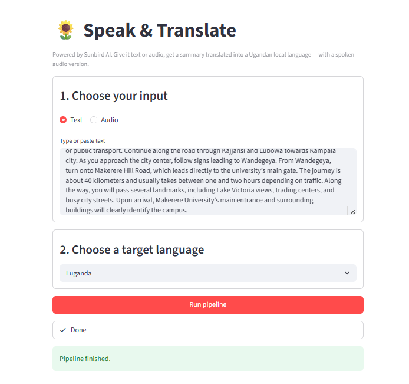
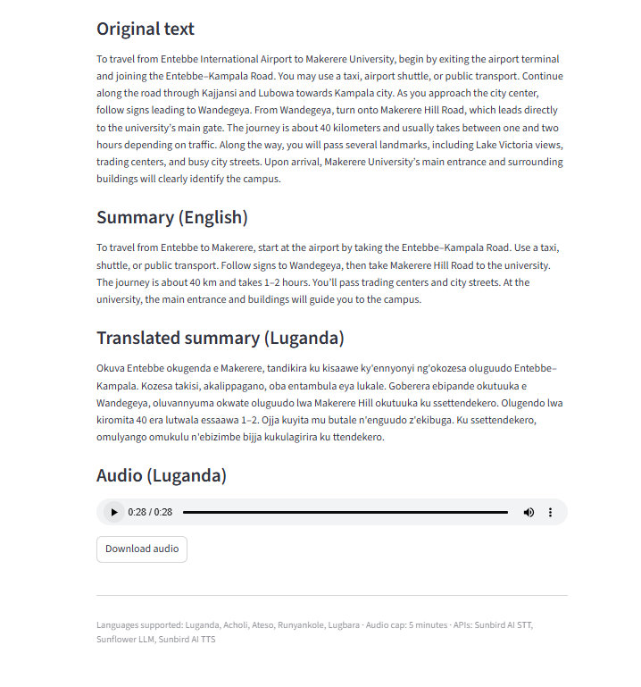

# 🌻 Speak & Translate — Sunbird AI Internship Assessment

A small Generative AI web app that takes English text or audio, summarises it, translates the summary into a Ugandan local language, and reads the translation aloud. Built end-to-end on Sunbird AI's APIs (Whisper-based STT, the Sunflower LLM, and Sunbird's TTS voices).

> Submitted by **Wasswa Job Kitandwe** for the Sunbird AI internship assessment, May 2026.

---

## What it does

Give the app either typed text or an uploaded audio file (≤ 5 minutes), pick a target Ugandan language, and it will:

1. Transcribe the audio (if audio was uploaded).
2. Summarise the text in 3–5 sentences.
3. Translate the summary into your chosen language.
4. Generate an audio version of the translation you can play and download.

Useful for: making English content accessible to local-language audiences, condensing long English speeches into local-language voice notes, and giving non-English speakers a quick spoken summary of a piece of writing.

---

## Architecture

The app is a single-page Streamlit UI backed by a small Python pipeline. Each pipeline step calls one Sunbird endpoint.

```
┌───────────────┐
│  Streamlit UI │   user picks input type, language, hits Run
└───────┬───────┘
        │
        ▼
┌────────────────────┐
│  pipeline.py       │   orchestrator + 5-min audio guard
└───────┬────────────┘
        │
   if audio:
        │
        ▼
┌────────────────────────────────────┐
│  STT — POST /tasks/modal/stt       │   audio bytes → transcript
└───────┬────────────────────────────┘
        │
        ▼
┌────────────────────────────────────┐
│  Summarise — sunflower_simple      │   long English → 3–5 sentence summary
└───────┬────────────────────────────┘
        │
        ▼
┌────────────────────────────────────┐
│  Translate — sunflower_simple      │   English summary → local language
└───────┬────────────────────────────┘
        │
        ▼
┌────────────────────────────────────┐
│  TTS — POST /tasks/modal/tts       │   local text → audio (signed URL)
└───────┬────────────────────────────┘
        │
        ▼
┌───────────────┐
│  Streamlit UI │   shows transcript, summary, translation, audio player
└───────────────┘
```

### Sunbird endpoints used

| Pipeline step | Endpoint | Purpose |
|---|---|---|
| Transcribe | `POST /tasks/modal/stt` | Audio → text |
| Summarise | `POST /tasks/sunflower_simple` | Sunflower LLM, single-turn instruction |
| Translate | `POST /tasks/sunflower_simple` | Sunflower LLM, single-turn instruction |
| Synthesise | `POST /tasks/modal/tts` | Text → audio file |

> Note on the docs: I followed the **API Reference** rather than the Guide pages, because the Guides were slightly out of date on endpoint paths and request shapes (e.g. `sunflower_simple` actually expects `application/x-www-form-urlencoded`, not JSON). The reference is the source of truth.

---

## Tech stack

- **Language:** Python 3.11+
- **UI:** [Streamlit](https://streamlit.io/) — chosen for a fast, single-file UI with built-in audio upload/playback widgets.
- **HTTP:** `requests` — minimal, well-understood.
- **Audio metadata:** `mutagen` — used purely to read the duration of uploaded files so we can enforce the 5-minute cap before sending anything to the API.
- **Config:** `python-dotenv` for local secret loading; Hugging Face Space secrets for production.
- **AI services:** Sunbird AI (STT, Sunflower LLM, TTS). No other model providers are called.

### Project layout

```
.
├── app.py                  # Streamlit entry point (UI)
├── backend/
│   ├── __init__.py
│   ├── sunbird_client.py   # one function per Sunbird endpoint
│   └── pipeline.py         # orchestrates the four steps + audio length check
├── requirements.txt
├── .env.example            # template for required env vars
├── .gitignore
└── PROJECT_README.md       # this file
```

The split keeps things easy to test: `sunbird_client.py` only knows how to talk to the API, `pipeline.py` only knows the order of operations, and `app.py` only knows about the UI.

---

## Live demo

> **🔗 Deployed app:** [https://huggingface.co/spaces/JobkWasswa/sunbird-speak-translate](https://huggingface.co/spaces/JobkWasswa/sunbird-speak-translate)

(See *Deployment* section below for how it's hosted.)

---

## Local setup

### Prerequisites

- Python 3.11 or newer
- A Sunbird AI API token (sign up at [api.sunbird.ai](https://api.sunbird.ai))

### Steps

```bash
# 1. Clone the repo
git clone https://github.com/JobkWasswa/internship-assessment.git
cd internship-assessment

# 2. Create and activate a virtual environment
python -m venv venv
# macOS / Linux:
source venv/bin/activate
# Windows (PowerShell):
.\venv\Scripts\Activate.ps1

# 3. Install dependencies
pip install -r requirements.txt

# 4. Configure your token
cp .env.example .env
# Open .env and replace the placeholder with your real Sunbird token

# 5. Run the app
streamlit run app.py
```

Streamlit will open at `http://localhost:8501`.

> **Windows tip:** if `streamlit` isn't recognised after install, use `python -m streamlit run app.py` instead — that always works inside an active venv.

---

## Environment variables

| Variable | Required | Description |
|---|---|---|
| `SUNBIRD_API_TOKEN` | ✅ Yes | Bearer token for the Sunbird AI API. Sign up at api.sunbird.ai, then copy your token from the dashboard. |

A `.env.example` is provided as a template. Never commit your actual `.env` to git — it's already in `.gitignore`.

---

## Usage walkthrough

1. **Choose input type** — pick **Text** to type/paste, or **Audio** to upload a file.
2. **Provide your input.**
   - For text: paste any English passage (e.g. an article, a story, or a paragraph from a report).
   - For audio: upload an MP3/WAV/OGG/M4A/AAC file no longer than 5 minutes.
3. **Pick a target language** — Luganda, Acholi, Ateso, Runyankole, or Lugbara.
4. **Click "Run pipeline"** — a spinner shows progress through each step.
5. **Read and listen to the results**:
   - The original text (or transcript, if audio)
   - The English summary
   - The translation in your chosen language
   - An audio player for the spoken translation, plus a download button.

### Screenshots

> Replace these with your own screenshots after deployment.


*The landing UI with text input selected.*


*A successful run showing original text, summary, translation, and audio player.*

---

## Deployment

The app is deployed to [Hugging Face Spaces](https://huggingface.co/spaces) using the Streamlit SDK. Hugging Face was the natural fit because:

- The whole stack is Python, so there's no need for a separate frontend host.
- Spaces redeploys automatically on every git push.
- Secrets (the Sunbird token) are managed cleanly in the Space settings, not in the repo.

**To redeploy:** push to the linked Space's git remote. The build picks up `requirements.txt` and runs `app.py` automatically.

---

## Known limitations

- **5-minute audio cap.** Enforced client-side using `mutagen` before upload. The Sunbird STT endpoint itself trims at 10 minutes; we cap earlier per the assignment brief.
- **Five target languages.** Limited to the languages that have both Sunflower LLM coverage and a Sunbird TTS voice (Luganda, Acholi, Ateso, Runyankole, Lugbara). Swahili has TTS but isn't part of the brief's requested set, so it's not exposed in the UI.
- **English source assumption.** The summarisation and translation prompts assume the source text is English. Local-language input would still get transcribed, but the summary prompt may not perform optimally on non-English input.
- **One-direction translation.** Translation is English → local language only; reverse direction is listed under *Future Work* below.
- **TTS quality variance.** TTS audio quality varies a little by language — Luganda is most polished; Lugbara is the newest voice.
- **Signed URL freshness.** TTS audio URLs from Sunbird are short-lived signed URLs. The app downloads the audio bytes immediately and streams them to the user, so this is invisible — but if you save the JSON response somewhere, that link will expire quickly.
- **Cold starts.** The first call after a period of inactivity can take 10–20 seconds extra while the model warms up. Subsequent calls are fast.

---

## Future work

These are intentional next steps, not bugs:

- **Reverse direction (local language → English).** Take a local-language audio clip or text, transcribe it (Sunbird STT auto-detects language), translate to English, and produce an English summary. The final TTS step would either fall back to the Swahili voice or be skipped (Sunbird doesn't currently offer an English voice). This would make the app symmetric and serve a different audience: Ugandans wanting to share local-language content with international readers.
- **Document upload.** Accept PDF/Word inputs, extract the text, and run the same pipeline — useful for summarising reports.
- **Conversation mode.** Use the multi-turn `sunflower_inference` endpoint for follow-up questions on the same content (e.g. "Now translate it to Acholi instead").
- **Caching.** Cache identical (text, language) pairs so repeated requests don't re-hit the API. Saves cost and time on demos.
- **Better error UX.** Currently the API errors are surfaced verbatim — useful for debugging, but a friendlier mapping ("the audio file format isn't supported, please try MP3 or WAV") would be a nice polish.

---

## Acknowledgments

- [Sunbird AI](https://sunbird.ai) for the APIs powering everything (STT, Sunflower LLM, TTS) and for the internship opportunity.
- [Streamlit](https://streamlit.io) for the UI framework that made this a pleasure to build.

---

*Built by Wasswa Job Kitandwe for the Sunbird AI internship assessment, May 2026.*
